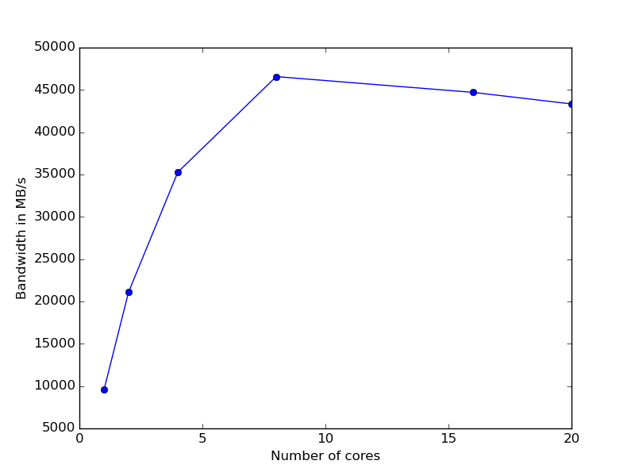
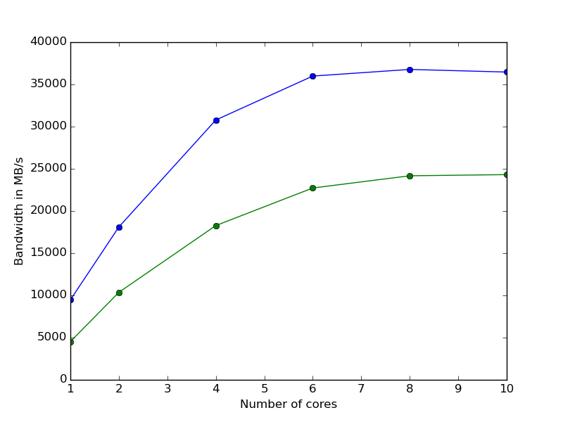
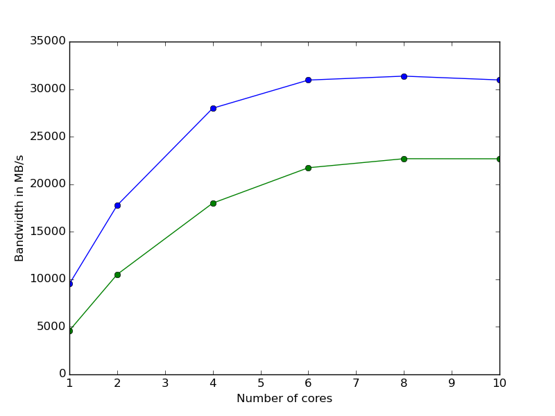

Report
-------------------

First Part
===========

The solution to first part is provided by **init_script**. This script produces the *plot.png* through the
*plot.py* python script. The program *stream* performs a very large amount of simples operations in order to
check the maximum bandwidth of the system. The program contains several OpenMP directives, thus has been
running with a variable number of threads in a given node of ulysess cluster. Roughly, we expect an increasing
bandwidth as long as the number of threads increases too. This appens because each single thread contributes to
increase the number of data processed per second. However, if the number of threads exceeds 10 the
bandwidth slightly decreases. This results are summarized in the following plot:

Second Part
===========

In the second part I have tested the *stream* program in two different configurations with the *numactl* command.
As in the previous part, I have increased the numbers of thread; but in this case with the *numactl* command I
forced the execution of the program just in one NUMA node of the cluster node. Moreover, I forced also the usage
of memory in two different configuration: the memory in the NUMA node of the processors and the memory of the
second NUMA node. The results are summarized in the following plots. 

In the higher plot the dimension of vector used in the *stream* program is 4*10^8, in the other is 8*10^8.
Clearly, the usage of memory near the processors is more powerful then the other case. Moreover, the maximum 
bandwidth of this case is always smaller then the case of the first part. This happens because without the 
numactl command the system distributes all processes in order to use the memory of both nodes. This allow to 
maximize the bandwidth.
